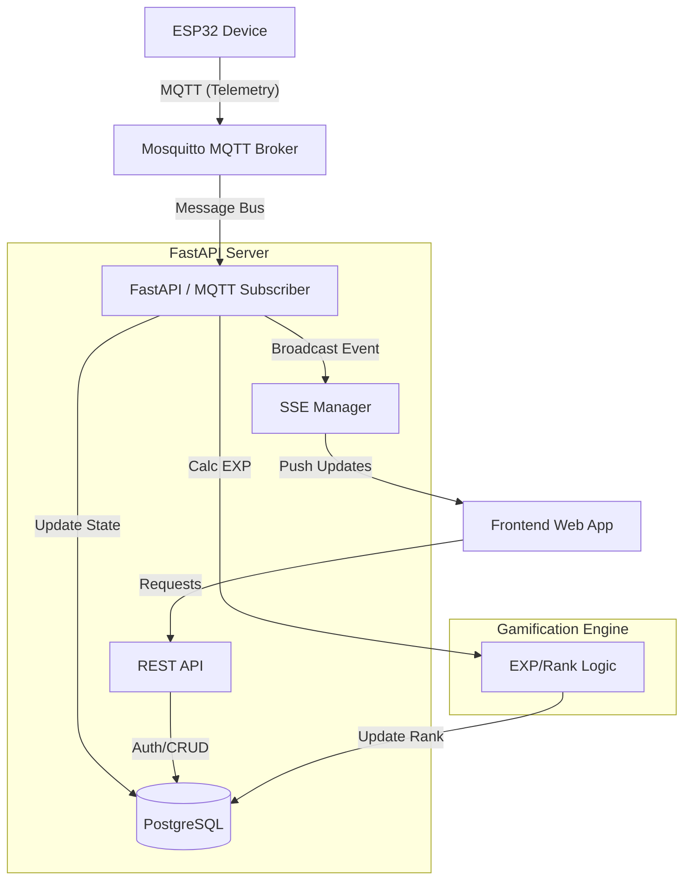

# Redesigned System Architecture - Mộc Đạo Tu Tiên

## 1. Overview
Hệ thống được chuyển đổi sang kiến trúc **Event-Driven** nhằm tối ưu hóa việc truyền nhận dữ liệu từ thiết bị IoT và cập nhật giao diện người dùng theo thời gian thực.

## 2. Component Diagram

## 3. Communication Protocols

| Route | Protocol | Purpose |
|---|---|---|
| **Device -> Backend** | **MQTT** | Gửi dữ liệu cảm biến định kỳ (Soil, Light, Temp). Tiết kiệm năng lượng và băng thông. |
| **Backend -> Frontend** | **SSE (Server-Sent Events)** | Đẩy thông báo thay đổi chỉ số môi trường và đột phá cảnh giới lên Dashboard. |
| **Frontend -> Backend** | **REST (HTTPS)** | Đăng nhập Google, cài đặt cây, xem lịch sử, quản lý Admin. |

## 4. Database Strategy (PostgreSQL)

- **Relational Tables:** `users`, `plants`, `devices`, `configs`.
- **Telemetry Table:** `sensor_readings`. Sử dụng index trên `created_at` và `plant_id`.
- **Optimization:** Sử dụng **Partitioning** theo thời gian (ví dụ: mỗi tháng một partition) nếu số lượng bản ghi vượt quá 10 triệu.

## 5. Technology Stack

- **Backend:** FastAPI (Python 3.12)
- **MQTT Broker:** Eclipse Mosquitto
- **MQTT Client:** `gmqtt` hoặc `fastapi-mqtt`
- **Database Driver:** `SQLAlchemy` + `alembic` + `asyncpg`
- **Real-time:** `sse-starlette`
- **Task Runner:** `BackgroundTasks` (cho các tác vụ nhẹ) hoặc `Celery` (nếu cần scale).

## 6. Security Architecture

1. **Device Security:** Mỗi thiết bị dùng một `client_id` duy nhất và mật khẩu (hoặc SSL certificate) để kết nối MQTT.
2. **API Security:** JWT (JSON Web Token) thông qua Google OAuth2.
3. **Data Integrity:** Backend kiểm tra `verify_code` trước khi cho phép thiết bị "join" vào một tài khoản.
