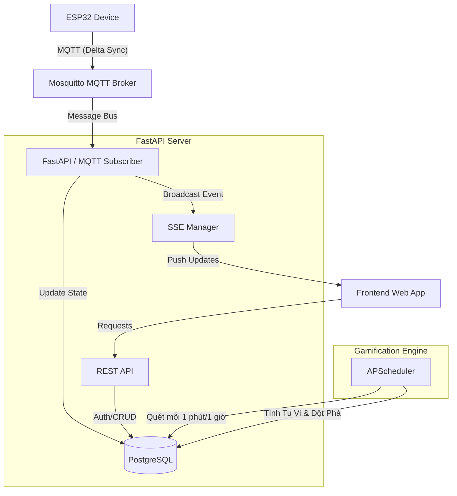

# Kiến Trúc Hệ Thống (System Architecture)
# Dự án: Mộc Đạo Tu Tiên (Flora Cultivation)

> **Bản cập nhật:** Phiên bản v2.0 (Hỗ trợ Delta Sync & Đa chậu)

Tài liệu này trình bày tổng quan về kiến trúc, cơ chế hoạt động, lược đồ cơ sở dữ liệu và các giao thức truyền thông của dự án **Mộc Đạo Tu Tiên**.

---

## 1. Tổng quan Kiến trúc (Overview)
Hệ thống sử dụng mô hình kết hợp giữa **Event-Driven (Real-time Telemetry)** và **Batch Processing (Gamification)** nhằm giải quyết bài toán chịu tải IoT lớn và tối ưu hóa thời lượng Pin cho thiết bị phần cứng.

---

## 2. Các Cơ chế Vận hành Cốt lõi (Core Mechanisms)

### 2.1. Telemetry & Delta Sync (IoT)
Thiết bị IoT (ESP32) **không gửi dữ liệu định kỳ**. Thay vào đó, thiết bị sử dụng cơ chế **Delta Sync**:
- Thiết bị đọc cảm biến liên tục ở chế độ local.
- Chỉ khi giá trị môi trường thay đổi vượt ngưỡng (ví dụ độ ẩm giảm > 5%), thiết bị mới bật WiFi và gửi MQTT.
- Backend tiếp nhận dữ liệu, cập nhật ngay trạng thái `current_overall_quality` vào DB và **bắn Server-Sent Events (SSE)** về Frontend để người dùng thấy thông số nhảy số lập tức (Real-time).

### 2.2. Batch Gamification (Tính điểm Tu Vi)
Để ngăn chặn spam từ IoT và tách biệt luồng game hóa:
- **KHÔNG tính điểm ngay khi nhận MQTT**.
- **Cronjob Background (APScheduler)**: Hoạt động âm thầm quét bảng `plants` theo chu kỳ định sẵn (ví dụ 1 tiếng/lần). 
- Dựa vào `current_overall_quality` mới nhất, hệ thống cộng điểm Tu Vi (EXP) đồng loạt cho tất cả chậu cây đang hoạt động.
- Nếu điểm Tu Vi đủ điều kiện, tự động thăng cấp (Đột phá Cảnh Giới).

### 2.3. Hỗ trợ Đa Chậu (Multi-plant) & DIY Provisioning
- Một người dùng (User) có thể liên kết (Pair) với **nhiều chậu cây** cùng lúc (quan hệ `1-N`).
- Người dùng có thể tự gọi API `/api/plants/diy-provision` để tự cấp mã `Plant Code` và `Verify Code`, hỗ trợ mô hình tự làm thiết bị phần cứng (DIY/Developer).

---

## 3. Kiến trúc Dữ liệu (Database Schema)

Hệ thống sử dụng **PostgreSQL** thông qua SQLAlchemy.

- **Users:** Thông tin người dùng (Google OAuth).
- **Devices:** Định danh phần cứng IoT (`plant_code`, `verify_hash`).
- **Plants:** Trung tâm hệ thống (Liên kết `User` <-> `Device`). Lưu trữ Tu Vi, cấp bậc (`current_rank_id`), và trạng thái môi trường mới nhất (`current_overall_quality`).
- **SensorReadings:** Dữ liệu lịch sử cảm biến thời gian thực (Time-series).
- **ExpLogs & BreakthroughEvents:** Nhật ký cộng điểm và lịch sử thăng cấp.
- **Config (ExpConfig, RankConfig, PlantTypes):** Các cấu hình game balance và ngưỡng sinh thái tiêu chuẩn.

---

## 4. Giao tiếp Truyền thông (Protocols)

| Luồng giao tiếp | Giao thức | Mục đích |
|---|---|---|
| **Device -> Backend** | **MQTT** | Gửi dữ liệu cảm biến nhẹ, nhanh, tối ưu băng thông. Thiết bị sử dụng `client_id` duy nhất để chống giả mạo. |
| **Backend -> Frontend** | **SSE (Server-Sent Events)** | Truyền tải dữ liệu một chiều (Live Dashboard) giúp Frontend tự cập nhật thông số ngay khi môi trường thay đổi. |
| **Frontend -> Backend** | **REST (HTTPS)** | Các tác vụ quản lý: Đăng nhập Google, tự cấp mã (DIY), liên kết cây, xem bảng xếp hạng. Bảo mật bằng JWT. |

---

## 5. Danh sách API Chính (Core APIs)

### 5.1. Authentication (Xác thực)
- `POST /api/auth/google`: Đăng nhập bằng Google ID Token, nhận JWT (Access & Refresh).
- `GET /api/auth/me`: Thông tin người dùng hiện tại (kèm danh sách cây sở hữu).

### 5.2. Quản lý Chậu cây (Plants)
- `POST /api/plants/diy-provision`: (MỚI) Tự tạo mã nạp thiết bị cho User DIY.
- `POST /api/plants/pair`: Liên kết Device vào tài khoản User.
- `GET /api/plants/me/dashboard`: Lấy thông tin cây để hiển thị màn chính.
- `GET /api/plants/me/history`: Xem biểu đồ dữ liệu lịch sử môi trường.

### 5.3. IoT Ingestion (Telemetry)
- Thiết bị gửi vào Topic: `plants/{plant_code}/telemetry`
- Payload dạng JSON: `{"soil_moisture": 45, "light": 1000, "temperature": 28, "humidity": 60}`

### 5.4. Leaderboard (Xếp hạng)
- `GET /api/leaderboard`: Danh sách cao thủ Tu Tiên (Top Cây có Tu Vi cao nhất).

---

## 6. Technology Stack (Công nghệ sử dụng)
- **Framework:** FastAPI (Python 3.12, Async).
- **Database:** PostgreSQL + SQLAlchemy 2.0 + Alembic + AsyncPG.
- **Message Broker:** Eclipse Mosquitto (MQTT).
- **Job Scheduler:** APScheduler (Background Cronjob).
- **Security:** JWT Authentication (Google OAuth), Bcrypt Hashing.
